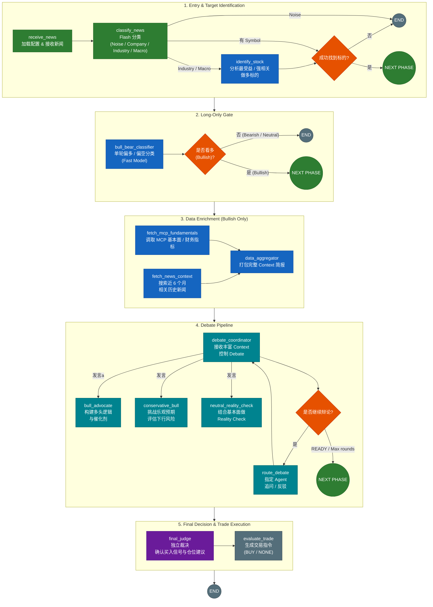

# News Analysis Workflow — Graph Flow

## Pipeline Overview


## 节点详解

### 1. `receive_news`
**文件**: [`nodes/setup.py`](nodes/setup.py)

- 从数据库加载 LLM 配置（API URL、Key、Model、MCP URL 等）
- 初始化 state 中的配置字段
- 如果 `llm_enabled=false`，清空所有 LLM URL，后续全部走 keyword fallback

### 2. `classify_news`
**文件**: [`nodes/filtering.py`](nodes/filtering.py)

- 用 **flash model**（快速模型）对新闻做四分类：
  - **Noise**（价格波动/市场回顾）→ 跳过
  - **Macro**（宏观经济/货币政策/地缘政治）→ 跳过
  - **Company**（公司具体事件）→ 继续分析
  - **Industry**（行业/板块事件）→ 需要先识别最佳标的
- 失败回退：LLM 不可用时新闻直接通过

### 3. `route_after_classify`
**文件**: [`nodes/filtering.py`](nodes/filtering.py)

条件路由，三条路径：

| 条件 | 目标 |
|---|---|
| Noise 或 Macro | `skip_to_end` |
| 有 symbol | `build_prompt` |
| 仅有 exchange | `identify_stock` |

### 4. `identify_stock`
**文件**: [`nodes/stock_identification.py`](nodes/stock_identification.py)

- 仅给出交易所（无具体股票代码）时调用
- LLM 根据新闻内容，在指定交易所中选出 **最受益的一只股票**
- 选中标准：最直接的盈利受益 + 最大市值 + 最高流动性
- 找不到合适标的 → 标记 `_filtered=True`

### 5. `route_after_identify`
**文件**: [`nodes/stock_identification.py`](nodes/stock_identification.py)

| 条件 | 目标 |
|---|---|
| 找到股票 | `build_prompt` |
| 未找到 | `skip_to_end` |

### 6. `skip_to_end`
**文件**: [`nodes/skip.py`](nodes/skip.py)

- 快速出口：不调用 LLM，直接返回 `neutral` + `confidence=0.3`
- 根据分类/识别阶段给出的理由生成上下文合理的说明

### 7. `build_prompt`
**文件**: [`nodes/prompt_building.py`](nodes/prompt_building.py)

- 构建 system prompt 和 user message
- 初始化对话历史 `state["messages"]`

### 8. `fetch_news_context`
**文件**: [`nodes/news_context.py`](nodes/news_context.py)

- 调用**独立的 context LLM**（可配置不同模型）搜索该股票近 6 个月的：
  - ✅ 正面事件（业绩超预期、合同、产品发布等）
  - ❌ 负面事件（监管罚款、业绩不及预期、产品召回等）
- 结果注入到对话的 user message 中，供 agent_node 参考

### 9. `agent_node`
**文件**: [`nodes/agent_loop.py`](nodes/agent_loop.py)

- 核心 LLM 调用节点，**可重入**（循环中每次回到这里都重新调用 LLM）
- 带 MCP 工具定义（`list_metrics`、`get_data_period`、`get_financials`）
- 如果 LLM 返回 `tool_calls` → 路由到 `execute_tools`
- 如果 LLM 返回纯文本 → 路由到 `parse_response`（退出循环）
- 无 LLM 时走 keyword fallback

### 10. `execute_tools`
**文件**: [`nodes/agent_loop.py`](nodes/agent_loop.py)

- 遍历所有待执行的 tool_calls
- 调用 MCP 工具（通过 [`tools/mcp_executor.py`](tools/mcp_executor.py)）
- 将结果追加到对话历史，`round_count += 1`
- 无条件回到 `agent_node`

### 11. `should_continue`
**文件**: [`nodes/agent_loop.py`](nodes/agent_loop.py)

循环控制逻辑：

| 条件 | 路由 |
|---|---|
| `tool_calls` 存在 且 `round_count < 5` | `execute_tools` |
| 否则 | `parse_response` |

### 12. `parse_response`
**文件**: [`nodes/output.py`](nodes/output.py)

- 从 LLM 原始响应中提取 JSON
- 验证 sentiment 值在 `SentimentLevel` 枚举中
- 解析出 `sentiment`、`confidence_score`、`reasoning`、`selected_symbol`

### 13. `evaluate_trade`
**文件**: [`nodes/output.py`](nodes/output.py)

情感 → 交易动作映射：

| Sentiment | TradeAction |
|---|---|
| 超级利好 | `BUY` |
| 超级利空 | `SHORT` |
| 其他 | `NONE` |

## 关键设计决策

### 双 LLM 分层架构

| 层 | 模型 | 用途 |
|---|---|---|
| Flash（快速） | `llm_flash_model` | 新闻分类 + 标的识别（低延迟、低成本） |
| Main（主力） | `llm_model` | 深度分析 + MCP 工具调用 |
| Context（上下文） | `context_llm_model` | 历史新闻检索 |

### Agent 工具循环

```python
MAX_TOOL_ROUNDS = 5  # 防止无限循环
```

LLM 可以在一次分析中多次调用 MCP 工具（比如先 `list_metrics`，再根据结果用特定指标调 `get_financials`），每次工具结果都追加到对话历史中送回 LLM，形成 ReAct 风格的推理循环。

### 快速跳过路径

Noise 和 Macro 类新闻不进入分析管线，在 `classify_news` 阶段就被拦截，直接走 `skip_to_end` → `evaluate_trade` → `END`，节省 LLM 调用成本。
