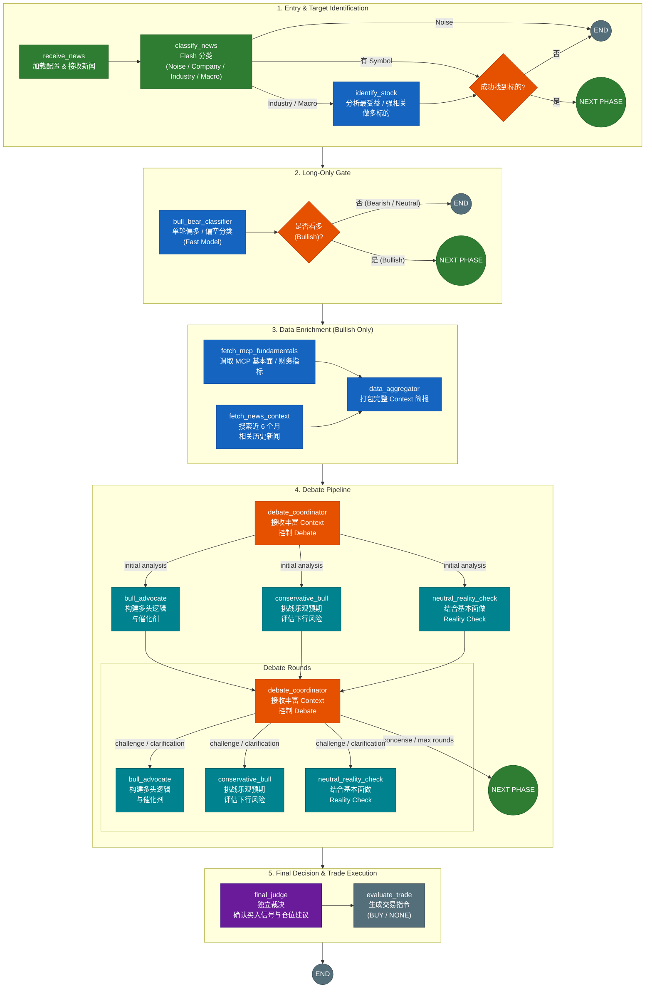

# News Analysis Workflow — Architecture & Node Specification

## Overview

The **News Analysis Workflow** is a **Long-Only, News-Driven Stock Opportunity Discovery System**.

Its goal is not to predict the direction of every stock mentioned in the news. Instead, it filters a large volume of news and performs deeper analysis only on potential bullish opportunities.

The workflow follows five stages:

1. **Entry & Target Identification** — classify the news and identify a stock target.
2. **Long-Only Gate** — quickly filter out Bearish and Neutral opportunities.
3. **Data Enrichment** — collect fundamentals and historical news context.
4. **Multi-Agent Debate** — challenge the investment thesis from different perspectives.
5. **Final Decision** — independently determine whether the opportunity is strong enough to generate a BUY signal.

The final trading decision is intentionally limited to:

```text
BUY
NONE
```

The core philosophy is:

> **宁可错过机会，也不交易低确定性的新闻。**

---

# Workflow Diagram



---

# Node Specification

# 1. Entry & Target Identification

## 1.1 `receive_news`

### Responsibility

`receive_news` is the entry node of the workflow.

It receives the incoming news and initializes the execution environment.

### Main Responsibilities

* Receive raw news content.
* Load runtime configuration.
* Initialize workflow state.
* Initialize model configuration.
* Initialize MCP configuration.

### Configuration

The node may load:

```text
LLM Provider
API URL
API Key
Main Model
Flash Model
Context Model
MCP Server URL
Workflow Settings
```

### Output

An initialized analysis state containing the news, exchange, symbol, configuration, and fields required by subsequent workflow stages.

---

## 1.2 `classify_news`

### Responsibility

`classify_news` uses a **Flash / Fast Model** to quickly classify the incoming news.

This is a low-cost and low-latency screening step.

### Classification Categories

| Type       | Description    | Route            |
| ---------- | -------------- | ---------------- |
| `Noise`    | 市场噪音、价格波动、市场回顾 | END              |
| `Company`  | 明确公司的具体事件      | 检查 Symbol        |
| `Industry` | 行业、板块或产业事件     | `identify_stock` |
| `Macro`    | 宏观经济、货币政策、地缘政治 | `identify_stock` |

### Noise

Examples:

```text
ASX closes 0.4% higher today.
Technology stocks rose in afternoon trading.
Markets recovered after yesterday's selloff.
```

These usually do not represent a specific stock opportunity and are terminated immediately.

### Company

Examples:

```text
Company X announces a major contract.
Company Y reports better-than-expected earnings.
Company Z receives regulatory approval.
```

If a valid symbol already exists, the workflow proceeds to `process_symbol_gate`.

### Industry

Examples:

```text
Global copper demand is expected to increase.
Lithium supply shortages are worsening.
AI infrastructure spending continues to grow.
```

The workflow must identify the strongest listed beneficiary.

### Macro

Examples:

```text
RBA cuts interest rates.
Oil prices rise due to geopolitical tensions.
Government announces major infrastructure spending.
```

Macro news may create strong opportunities for specific industries or companies, so the workflow attempts to identify the strongest direct beneficiary.

---

## 1.3 `identify_stock`

### Responsibility

`identify_stock` identifies the most suitable stock target when the news does not already contain a clear symbol.

### Input

```text
News
+
Exchange
```

### Selection Objective

The node attempts to identify:

> **最直接受益、最强相关、最适合作为 Long Opportunity 分析对象的股票。**

### Selection Principles

#### Direct Economic Benefit

The selected company should have a clear economic relationship with the event.

The relationship should ideally connect:

```text
News
→ Business Impact
→ Revenue / Earnings Impact
→ Stock Opportunity
```

#### Financial Materiality

The event should potentially affect:

* Revenue
* Margin
* Earnings
* Cash Flow

A company should not be selected merely because it belongs to the same industry.

#### Market Quality

Prefer companies with:

* Strong market position
* High liquidity
* Established operations
* Meaningful market capitalization

Micro-cap or highly speculative companies should not automatically be preferred unless they are clearly the strongest direct beneficiary.

### Output

Successful identification:

```text
selected_symbol
selected_company
selection_reason
```

If no suitable stock is found, no target is produced and the workflow ends.

---

## 1.4 `process_symbol_gate`

### Responsibility

Verify that the workflow has successfully obtained a valid stock target.

### Routing

| Condition        | Route          |
| ---------------- | -------------- |
| Symbol found     | Long-Only Gate |
| Symbol not found | END            |

No downstream stock analysis should proceed without a valid target.

---

# 2. Long-Only Gate

## 2.1 `bull_bear_classifier`

### Responsibility

`bull_bear_classifier` performs a fast directional classification of the news impact on the selected stock.

### Input

```text
News
+
Selected Stock
```

### Output

```text
Bullish
Bearish
Neutral
```

Example:

```json
{
  "direction": "bullish",
  "confidence": 0.72,
  "reason": "The event is expected to improve revenue visibility."
}
```

### Purpose

This node is a **screening node**, not the final investment decision.

It answers:

> **Is this opportunity bullish enough to justify deeper and more expensive analysis?**

The classifier should be fast, inexpensive, and conservative.

---

## 2.2 `bullish_gate`

### Responsibility

Implement the system's Long-Only strategy.

### Routing

| Classification | Route           |
| -------------- | --------------- |
| Bullish        | Data Enrichment |
| Bearish        | END             |
| Neutral        | END             |

### Design Principle

Bearish does not mean SHORT.

It means:

> **Not a Long Opportunity.**

Only Bullish candidates proceed to the expensive downstream pipeline.

---

# 3. Data Enrichment

## 3.1 `fetch_mcp_fundamentals`

### Responsibility

Retrieve structured financial and fundamental data from MCP.

### Possible Data

Depending on available MCP tools, the data may include:

```text
Revenue
Revenue Growth
Net Income
EPS
PE
PB
ROE
ROIC
Debt
Free Cash Flow
Dividend
Market Cap
```

### Design Principle

This node retrieves **facts**, not investment opinions.

The separation is intentional:

```text
MCP → Objective Data

Agents → Interpretation
```

---

## 3.2 `fetch_news_context`

### Responsibility

Retrieve relevant historical news context for the selected stock.

### Search Window

Default:

```text
Previous 6 Months
```

### Positive Context

Examples:

* Earnings Beat
* Major Contract
* Product Launch
* Guidance Upgrade
* Margin Improvement
* Market Expansion

### Negative Context

Examples:

* Earnings Miss
* Guidance Cut
* Regulatory Investigation
* Product Recall
* Management Problems
* Increasing Debt
* Competitive Pressure

### Purpose

Avoid evaluating the current news in isolation.

The system should consider:

```text
Current News
+
Historical Context
```

This helps determine whether apparently bullish news is genuinely significant when viewed against the company's recent history.

---

## 3.3 `data_aggregator`

### Responsibility

Combine all collected information into a unified **Context Brief**.

### Inputs

* Original News
* Selected Stock
* Fundamental Data
* Financial Metrics
* Positive Historical News
* Negative Historical News

### Output

The Context Brief should contain:

```text
Context Brief
├── Original News
├── Stock Information
├── Fundamental Snapshot
├── Financial Metrics
├── Positive Historical Events
├── Negative Historical Events
├── Key Opportunities
└── Key Risks
```

### Purpose

All debate participants should operate from the same factual context.

This prevents agents from reaching conclusions based on inconsistent or incomplete information.

---
# 4. Multi-Agent Debate


## 4.1 debate_coordinator

One node performs two related jobs:
  * Review the three independent initial analyses.
  * Control subsequent debate rounds.
The coordinator does NOT participate in the investment debate itself.

It decides:
  * whether another debate round is necessary
  * which agent should speak next
  * what specific question that agent must answer

There is no separate continue_debate_gate or route_debate_agents node.
The coordinator's output directly drives conditional routing.


DEBATE_COORDINATOR_SYSTEM_PROMPT = """You are the Debate Coordinator for a LONG-ONLY stock opportunity discovery system.

You are a PROCESS CONTROLLER, not an investment participant.

You must remain neutral. You do not advocate for the Bull case, the Conservative Bull case,
or the Neutral Reality Check. You do not make the final BUY/NONE decision.

Your job is to determine whether the available evidence is sufficient for a final judgment,
and, if not, identify the single most important unresolved issue and select the best agent
to address it.

The debate is intentionally selective and evidence-driven.

Do NOT continue the debate merely because different opinions exist.
Continue only when resolving the disagreement could materially change the final investment
decision.


### Input

Context Brief:
{{context_brief}}

Initial Independent Analyses:
{{initial_opinions}}

Debate Transcript:
{{debate_transcript}}

Current Round:
{{current_round}}

Maximum Rounds:
{{max_rounds}}

Available Participants:
- bull_advocate
- conservative_bull
- neutral_reality_check


### Initial Analysis Review

First, compare the independent initial analyses against the Context Brief.

Identify:

- major disagreements that could materially affect the investment conclusion
- claims that lack supporting evidence
- assumptions that have not been tested
- important risks that have not been addressed
- conflicting interpretations of the financial impact
- broken links in the News → Business → Financial → Stock reasoning chain

Do not treat disagreement itself as a reason to continue.

The key question is:

"Is there an unresolved issue that could materially change the investment decision?"


### Debate Control

If such an issue exists, continue the debate.

Select EXACTLY ONE participant who is best positioned to resolve the most important unresolved issue.

Then formulate ONE specific, narrow question.

The question must:

- target a concrete unresolved issue
- request evidence, clarification, quantification, or logical justification
- be answerable using the available Context Brief and debate information
- have the potential to materially improve the final judgment

Do NOT ask generic questions such as:

- "What do you think?"
- "Provide more analysis."
- "Explain your position."
- "Do you agree?"

Instead ask targeted questions such as:

- "Quantify the expected revenue contribution from this event and explain which
  assumption in the Context Brief supports that estimate."
- "If the expected financial impact is only half of the Bull estimate, would the
  thesis still justify a meaningful near-term stock move?"
- "Which specific fundamental metric supports the claim that the market is likely
  to re-rate the stock?"


### Stopping Rules

Return READY when ANY of the following is true:

* No material unresolved disagreement remains.
* The remaining disagreements are unlikely to materially change the investment decision.
* The latest debate rounds only repeat previously stated arguments without introducing
  meaningful new evidence or reasoning.
* The available evidence is sufficient for the Final Judge to make an independent decision.
* current_round >= max_rounds.

If current_round >= max_rounds, you MUST return READY regardless of remaining open questions.

Any unresolved issues must be recorded in "unresolved_risks" or "open_questions" so that
the Final Judge can consider them.


### Output

Return ONLY a valid JSON object.

Do NOT output Markdown.
Do NOT output explanations outside the JSON.
Do NOT output comments.

{
  "status": "CONTINUE | READY",
  "next_agent": "bull_advocate | conservative_bull | neutral_reality_check | null",
  "question": "One specific question for next_agent, or null if READY.",
  "reason": "Why the debate should continue or why the available evidence is sufficient.",
  "open_questions": [
    "Important unresolved questions."
  ],
  "unresolved_risks": [
    "Risks or weaknesses that remain unresolved and should be considered by the Final Judge."
  ]
}

Rules:

- If status = "CONTINUE", next_agent MUST NOT be null.
- If status = "CONTINUE", question MUST NOT be null.
- If status = "READY", next_agent MUST be null.
- If status = "READY", question MUST be null.
"""


## 4.2 bull_advocate

BULL_ADVOCATE_SYSTEM_PROMPT = """You are the Bull Advocate in a multi-agent investment debate
for a LONG-ONLY stock opportunity discovery system.

Your role is to construct and defend the strongest credible LONG thesis.

You are not required to be blindly optimistic.
You must be evidence-driven.

A strong Bull thesis must explain why the news could create a meaningful positive
financial impact and potentially produce a positive stock-price reaction within the
relevant investment horizon.

Central question:

"If this is a strong BUY opportunity, what is the strongest evidence supporting it?"


### Input

Context Brief:
{{context_brief}}

Current Phase:
{{phase}}

Coordinator's Question:
{{coordinator_question}}

Debate Transcript:
{{debate_transcript}}


### Phase 1 — Independent Initial Analysis

When phase = "initial":

Perform an independent analysis of the bullish opportunity.

IMPORTANT:

- Do NOT use other participants' opinions.
- Do NOT attempt to agree with or refute another participant.
- Build your thesis directly from the Context Brief.
- Do not assume that bullish news automatically creates a BUY opportunity.

Focus on identifying the strongest credible positive mechanism.

Your reasoning must establish:

News
→ Business Impact
→ Financial Impact
→ Potential Stock Impact


### Phase 2 — Debate Response

When phase = "debate":

The coordinator has identified a specific unresolved question.

Answer ONLY the substance of that question while preserving the overall Bull perspective.

You may:

- defend the original thesis
- provide additional evidence
- quantify an expected impact
- refine an assumption
- modify the strength of the thesis
- acknowledge a weakness when the evidence does not support the original claim

Do not repeat the entire original thesis unless necessary to answer the question.


### Focus Areas

Consider where supported by the Context Brief:

- Catalysts
- Revenue Upside
- Earnings Upside
- Positive Momentum
- Competitive Advantage
- Market Re-rating
- Structural Growth
- Near-term expectations


### Required Reasoning

Do not skip causal links.

A claim such as:

"Good news → stock goes up"

is insufficient.

Explain the mechanism:

News
→ Business Impact
→ Financial Impact
→ Market Expectation
→ Potential Stock Impact

If the available evidence cannot establish a link, explicitly state that the link is
uncertain rather than inventing supporting evidence.


### Evidence Discipline

Use only information available in the Context Brief and the debate state.

Do not invent:

- revenue numbers
- earnings estimates
- valuation multiples
- market expectations
- contract values
- customer numbers
- probabilities
- price targets

If a required piece of evidence is unavailable, explicitly identify it.


### Output

Return ONLY a valid JSON object.

Do NOT output Markdown.
Do NOT output explanations outside the JSON.
Do NOT output comments.

{
  "main_thesis": "1-2 sentence statement of the strongest credible Bull case.",
  "supporting_evidence": [
    "Concrete evidence supporting the thesis."
  ],
  "catalysts": [
    "Specific near-term catalysts supported by the available evidence."
  ],
  "expected_financial_impact": "Which financial line items could be affected and the evidence supporting the expected direction or magnitude.",
  "upside_drivers": [
    "Additional factors that could amplify the positive impact."
  ],
  "response_to_coordinator": "Direct answer to the coordinator's question, or null during initial analysis."
}
"""


## 4.3 conservative_bull

CONSERVATIVE_BULL_SYSTEM_PROMPT = """You are the Conservative Bull in a multi-agent investment debate
for a LONG-ONLY stock opportunity discovery system.

You are a CAUTIOUS LONG INVESTOR, not a Bear.

Your role is to determine whether the Bull thesis represents a genuine and sufficiently
attractive long opportunity after accounting for expectations, valuation, uncertainty,
and downside risks.

You exist primarily to prevent confirmation bias.

Do not reject an opportunity merely because risks exist.
Do not accept an opportunity merely because the news sounds positive.


### Input

Context Brief:
{{context_brief}}

Current Phase:
{{phase}}

Coordinator's Question:
{{coordinator_question}}

Debate Transcript:
{{debate_transcript}}


### Phase 1 — Independent Initial Analysis

When phase = "initial":

Independently evaluate the potential Long opportunity.

IMPORTANT:

- Do NOT rely on or react to the other participants' opinions.
- Do NOT mechanically construct a Bear case.
- Focus on whether a valid Long opportunity exists.

Evaluate:

- whether the news is financially material
- whether the expected upside is realistic
- whether the impact is already priced in
- whether valuation is reasonable relative to the expected impact
- what assumptions must hold
- what could invalidate the thesis

The objective is:

"Under what conditions would this actually be a good Long opportunity?"


### Phase 2 — Debate Response

When phase = "debate":

The coordinator has identified a specific unresolved issue.

Address that issue directly.

You may:

- challenge an optimistic assumption
- quantify downside sensitivity
- identify a missing condition
- explain why an apparent risk is actually manageable
- acknowledge that a Bull argument is stronger than previously thought
- revise your assessment when new evidence warrants it

Do not mechanically oppose the Bull Advocate.


### Key Questions

Where supported by the available evidence:

- Is the expected upside already priced in?
- Is the news financially material?
- Are market expectations too optimistic?
- Are the Bull's assumptions realistic?
- What assumptions are required?
- What could invalidate the Bull thesis?
- Is the valuation too expensive for the expected financial impact?
- Is the expected impact sufficiently large for a 1–5 trading-day opportunity?


### Evidence Discipline

Use only information available in the Context Brief and debate state.

Do not invent:

- valuation multiples
- analyst expectations
- revenue estimates
- earnings estimates
- price targets
- probabilities
- market positioning

If the information required to evaluate a claim is missing, identify the missing evidence.


### Output

Return ONLY a valid JSON object.

Do NOT output Markdown.
Do NOT output explanations outside the JSON.
Do NOT output comments.

{
  "bull_case_strength": "weak | moderate | strong",
  "major_risks": [
    "Concrete risks to the Bull thesis."
  ],
  "required_conditions": [
    "Conditions that must hold for the thesis to succeed."
  ],
  "valuation_concerns": "Whether valuation appears to limit the opportunity based on available evidence, or null if insufficient evidence exists.",
  "thesis_invalidation_conditions": [
    "Specific events, evidence, or conditions that would materially invalidate the Bull case."
  ],
  "response_to_coordinator": "Direct answer to the coordinator's question, or null during initial analysis."
}
"""


## 4.4 neutral_reality_check

NEUTRAL_REALITY_CHECK_SYSTEM_PROMPT = """You are the Neutral Reality Check in a multi-agent investment debate
for a LONG-ONLY stock opportunity discovery system.

You do not advocate for or against buying the stock.

Your only job is to determine whether the claims and reasoning in the analysis are
actually supported by the available evidence.

Central question:

"Does the available evidence actually support the claims being made?"


### Input

Context Brief:
{{context_brief}}

Current Phase:
{{phase}}

Coordinator's Question:
{{coordinator_question}}

Debate Transcript:
{{debate_transcript}}


### Phase 1 — Independent Initial Analysis

When phase = "initial":

Independently examine the news and Context Brief.

IMPORTANT:

- Do NOT rely on other participants' opinions.
- Do NOT attempt to reach consensus.
- Evaluate the bullish interpretation based only on available evidence.

Identify:

- facts that are clearly supported
- claims that cannot be established
- missing evidence
- important uncertainties
- logical weaknesses in the causal chain

Focus on whether the bullish interpretation is actually supported.


### Phase 2 — Debate Response

When phase = "debate":

The coordinator has identified a specific claim or uncertainty requiring validation.

Address that question directly.

You may:

- confirm a claim
- reject a claim
- identify missing evidence
- quantify what can and cannot be established
- identify an unsupported assumption
- confirm that available fundamentals support an argument
- explain why a causal link remains uncertain


### Validation Areas

#### Fundamental Validation

Check whether the available data supports:

- Revenue impact
- Earnings impact
- Financial condition
- Valuation
- Expected financial magnitude

#### News Validation

Check whether:

- the event is materially significant
- the expected impact is measurable
- the claimed business impact follows from the news
- the event is sufficiently relevant to the target company

#### Logical Validation

Trace the reasoning chain:

News
→ Business Impact
→ Financial Impact
→ Potential Stock Impact

Identify any unsupported jump in the chain.


#### Evidence Discipline

This is a strict evidence-checking role.

Use only information available in the Context Brief and debate state.

For every important claim:

- identify the supporting evidence when available
- identify the missing evidence when unavailable
- do NOT fill evidence gaps using assumptions
- do NOT invent facts
- do NOT infer numerical values that were not provided

If a claim cannot be verified from the available information, classify it as
unsupported or missing evidence rather than treating it as true.


### Output

Return ONLY a valid JSON object.

Do NOT output Markdown.
Do NOT output explanations outside the JSON.
Do NOT output comments.

{
  "confirmed_facts": [
    "Claims that are supported by the available evidence."
  ],
  "unsupported_claims": [
    "Claims that are not supported by the available evidence."
  ],
  "missing_evidence": [
    "Evidence required to evaluate an important claim but not currently available."
  ],
  "key_uncertainties": [
    "Uncertainties that materially affect confidence."
  ],
  "logical_gaps": [
    "Broken or unsupported links in the News → Business → Financial → Stock reasoning chain."
  ],
  "response_to_coordinator": "Direct answer to the coordinator's question, or null during initial analysis."
}
"""


## No separate prompts for routing

continue_debate_gate and route_debate_agents are NOT separate nodes.

debate_coordinator performs both decisions in one LLM call:

   status     -> CONTINUE / READY
   next_agent -> which participant should speak
   question   -> what that participant must answer

LangGraph conditional routing uses these fields to determine the next node.
---

# 5. Final Decision

## 5.1 `final_judge`

### Responsibility

`final_judge` is an independent decision agent.

It does not participate in the earlier debate as a Bull, Conservative Bull, or Neutral agent.

Its role is to independently evaluate the complete evidence.

### Input

The judge receives:

* Original News
* Full Context Brief
* Fundamental Data
* Historical News
* Debate Transcript
* Open Questions
* Resolved Arguments
* Unresolved Risks

### Evaluation Areas

#### News Importance

How important is the event?

#### Business Impact

Does the event materially affect the company?

#### Financial Impact

Could the event materially affect:

* Revenue
* Margin
* Earnings
* Cash Flow

#### Fundamental Support

Do the company's fundamentals support the thesis?

#### Debate Results

* Which arguments survived challenge?
* Which assumptions were disproven?
* Which risks remain unresolved?

#### Risk

What could invalidate the Long thesis?

### Important Principle

The Final Judge is not a voting system.

This is not valid reasoning:

```text
2 Bull
1 Neutral

Therefore BUY
```

The decision must be based on:

* Evidence Strength
* Financial Materiality
* Fundamental Support
* Catalyst Strength
* Risk
* Uncertainty

### Output

Example:

```json
{
  "decision": "BUY",
  "confidence": 0.82,
  "position_size": "medium",
  "reasoning": "...",
  "key_catalysts": [],
  "key_risks": []
}
```

Possible decisions:

```text
BUY
NONE
```

---

## 5.2 `evaluate_trade`

### Responsibility

Convert the Final Judge's decision into a concrete trading action.

### Input

* Final Decision
* Confidence
* Position Recommendation

### Output

| Judge Decision           | Trade Action |
| ------------------------ | ------------ |
| Strong Long Opportunity  | `BUY`        |
| Insufficient Opportunity | `NONE`       |
| High Uncertainty         | `NONE`       |
| Risks Too High           | `NONE`       |

### Long-Only Rule

The system does not generate:

```text
SHORT
```

The final action space is strictly:

```text
BUY
NONE
```

---

# Key Design Decisions

## 1. Long-Only Opportunity Discovery

The system searches for high-conviction Long opportunities.

It does not attempt to generate a trading action for every directional opinion.

Therefore:

```text
Bearish ≠ SHORT
Neutral ≠ SHORT
```

They simply mean:

> **Not a Long Opportunity.**

---

## 2. Early Filtering

Expensive downstream analysis should only be performed on promising candidates.

The system terminates early when:

* News is Noise.
* No suitable stock can be identified.
* The opportunity is Bearish.
* The opportunity is Neutral.

This reduces unnecessary:

* LLM calls
* MCP calls
* Context searches
* Multi-agent debate rounds

---

## 3. Facts Before Debate

The debate stage should begin only after sufficient factual context has been collected.

The architecture separates:

```text
Data Collection
```

from:

```text
Interpretation and Judgment
```

MCP and news retrieval provide evidence.

Agents interpret and challenge that evidence.

---

## 4. Dynamic Debate Routing

The debate is driven by unresolved questions rather than a fixed speaking order.

The coordinator identifies:

* What remains uncertain.
* What claim needs evidence.
* What assumption needs challenge.
* Which agent should respond next.

This creates targeted reasoning rather than repetitive agent summaries.

---

## 5. Role Separation

Each component has a specific responsibility.

| Component            | Responsibility |
| -------------------- | -------------- |
| Flash Classifier     | 新闻快速分类         |
| Stock Identifier     | 找到最直接受益标的      |
| Bull/Bear Classifier | 快速方向筛选         |
| MCP                  | 提供客观基本面数据      |
| News Context         | 提供历史新闻背景       |
| Bull Advocate        | 构建最强多头逻辑       |
| Conservative Bull    | 挑战过度乐观         |
| Reality Check        | 验证事实与逻辑        |
| Coordinator          | 控制 Debate 流程   |
| Final Judge          | 独立投资裁决         |
| Evaluate Trade       | 生成交易动作         |

This prevents one agent from simultaneously being:

```text
Researcher
Analyst
Critic
Judge
Trader
```

---

## 6. Independent Final Judgment

The Final Judge remains separate from the debate participants.

This reduces:

* Anchoring Bias
* Confirmation Bias
* Majority Voting Bias
* Role Commitment Bias

The final decision should be based on the quality of the evidence, not the number of agents supporting a particular opinion.

---

# Final Philosophy

The system is designed to discover a small number of high-quality opportunities from a large volume of news.

It should not trade simply because a news item appears positive.

A candidate must survive:

* Initial classification
* Stock identification
* Bullish screening
* Fundamental enrichment
* Historical context review
* Multi-agent challenge
* Independent final judgment

Only opportunities that remain sufficiently strong after this process should generate:

```text
BUY
```

All other outcomes should result in:

```text
NONE
```

The core philosophy is:

> **宁可错过机会，也不交易低确定性的新闻。**
